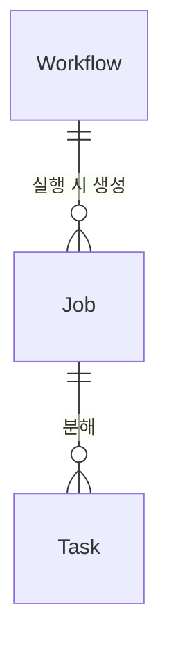

# Mental Model Generator

코드베이스의 앱/서비스 디렉토리를 받아, 도메인 어휘 수립 → 다해상도 구조 분석 → 시나리오 관통선으로 멘탈 모델 문서를 생성한다.

**목적**: 자연어 요구사항이 들어왔을 때, 어느 코드를 어떤 맥락에서 수정해야 하는지 파악하기 위한 다층적 구조 이해를 제공한다.

**인지도식 프레임워크**:
- **Foundation**: 도메인 어휘를 먼저 수립 — 범례 없이는 지도를 읽을 수 없다
- **Map (L0~L5)**: 6단계 해상도로 코드 구조를 본다 — 위성사진에서 배선도까지
- **Method (Scenario Thread)**: 핵심 유스케이스를 전 레벨에 걸쳐 관통한다 — 한 번도 길을 걸어보지 않으면 도시를 안다고 할 수 없다

**핵심 원칙**:
- Phase 1~2에서 메인이 어휘와 구조를 파악한 후, **Phase 3 이후의 상세 분석은 Agent에 위임**하여 메인 컨텍스트를 보호한다
- 분석은 도메인 슬라이스별 Agent에 위임하여 **attention 균일성**을 유지한다
- 모든 중간 결과는 **파일로 저장**하고, 종합도 별도 Agent에 위임한다
- **LLM이 직접 코드를 읽는다** — bash 정적 파서를 사용하지 않는다
- Agent당 분석 파일 수를 **20개 이하로 강제**하여 개별 요소의 분석 정확도를 보장한다

---

## 사용법

```
# Mode A: 전체 구조 분석
/mental-model {대상 경로}
/mental-model {대상 경로} --repo {repo_name} --app {app_name}
/mental-model {대상 경로} --output {출력 경로}

# Mode B: 변경 분석
/mental-model {대상 경로} --diff {base_branch}
/mental-model {대상 경로} --diff {commit_range}
```

인자 설명:
- `{대상 경로}`: 분석할 앱/서비스의 루트 디렉토리 (예: `application/app-api`)
- `--repo`: 레포 이름 (생략 시 자동 감지)
- `--app`: 앱 이름 (생략 시 대상 경로에서 추출)
- `--output`: 최종 결과 저장 경로 (생략 시 `${DATA_DIR}/mental-model.md`)
- `--diff`: 변경 분석 모드. base branch 또는 commit range 지정 (생략 시 main)

---

## 인자 해석 및 데이터 디렉토리 결정

### REPO_NAME 결정
```
1. --repo 인자가 있으면 → 그 값 사용
2. 없으면 → basename $(git rev-parse --show-toplevel 2>/dev/null) 로 현재 git 레포명 추출
3. git 레포도 없으면 → "❌ --repo를 지정하거나 git 레포 안에서 실행하세요." 출력 후 스킬 종료
```

### APP_NAME 결정
```
1. --app 인자가 있으면 → 그 값 사용
2. 없으면 → {대상 경로}의 마지막 경로 요소를 추출 (예: application/app-api → app-api)
3. 추출 불가 시 → "❌ --app을 지정하거나 유효한 대상 경로를 입력하세요." 출력 후 스킬 종료
```

### SOURCE_ROOT / MODULE_ROOT 결정
```
SOURCE_ROOT = {대상 경로}  (예: application/app-api)
MODULE_ROOT = SOURCE_ROOT  (대부분 동일. 빌드 파일이 상위에 있으면 그 경로를 MODULE_ROOT로 사용)
```

### OUTPUT_PATH 결정
```
1. --output 인자가 있으면 → 그 값 사용
2. 없으면 → ${DATA_DIR}/mental-model.md
```

### DATA_DIR 구성
```bash
DATA_ROOT=$HOME/.discovery-skills/mental-model
DATA_DIR=${DATA_ROOT}/repos/${REPO_NAME}/apps/${APP_NAME}
mkdir -p ${DATA_DIR}/domains ${DATA_DIR}/changes
```

모든 중간 산출물과 최종 결과는 `${DATA_DIR}`에 영속 저장된다 (스킬 디렉토리 외부):
```
$HOME/.discovery-skills/mental-model/repos/{repo_name}/apps/{app_name}/
├── foundation.md          # Phase 1 도메인 개념
├── recon.md               # Phase 2 구조 탐색 결과
├── context_map.md         # Phase 2 맥락 맵
├── domains/               # Phase 3 도메인별 분석
│   ├── {slice_name}.md
│   └── ...
├── scenario_threads.md    # Phase 4 시나리오 관통선
├── mental-model.md        # Phase 5 최종 멘탈 모델
└── changes/               # Mode B 변경 분석
    └── {날짜}-{branch}.md
```

---

## 분석 프레임워크

| 구성 요소 | 역할 | 담당 Phase |
|-----------|------|-----------|
| Foundation | 도메인 어휘 수립 — 코드가 표현하는 세계의 개념을 정의 | Phase 1 |
| Map (L0~L5) | 6단계 해상도 구조 분석 — 위성사진에서 배선도까지 | Phase 2, 3 |
| Scenario Thread | 핵심 유스케이스 전 레벨 관통 — 구조 위에서 이야기를 따라감 | Phase 4 |

**줌 레벨 참조표**:

| 레벨 | 단위 | 질문 | 담당 |
|------|------|------|------|
| L0 | 시스템 경계 | 누가 쓰고 뭐랑 연결? | Phase 2 메인 |
| L1 | 서비스/DB/큐 | 서비스가 어떻게 연결? | Phase 2 메인 |
| L2 | 모듈/레이어 | 서비스 안이 어떻게 나뉘어? | Phase 2 + Phase 3 |
| L3 | 클래스/인터페이스 | 어떤 클래스가 관여? | Phase 3 Agent |
| L4 | 시퀀스/플로우 | 어떤 순서로 실행? | Phase 3 Agent |
| L5 | 로직/상태 | 안에서 무슨 판단을 하는가? | Phase 3 Agent (선택적) |

> L0→L3은 **줌인**(같은 관점에서 해상도 증가), L3→L4는 **뷰 전환**(정적 구조 → 동적 행위), L4→L5는 다시 **줌인**(메서드 간 → 메서드 내부)

---

## 실행 파이프라인

```
Phase 1: Foundation (메인 직접)
  → ${DATA_DIR}/foundation.md

Phase 2: Reconnaissance (메인 직접)
  → ${DATA_DIR}/recon.md + context_map.md
  → 슬라이스 목록 + 파일 할당

Phase 3: Parallel Zoom Analysis (도메인별 Agent 병렬, 배치 5개)
  → ${DATA_DIR}/domains/{slice_name}.md

Phase 4: Scenario Thread (Agent)
  → ${DATA_DIR}/scenario_threads.md

Phase 5: Synthesis (종합 Agent)
  → ${OUTPUT_PATH} (기본: ${DATA_DIR}/mental-model.md)

Phase 6: Report (메인이 경로만 안내)
```

---

### Phase 1: Foundation — 도메인 개념 수립

**실행 주체**: 메인 오케스트레이터가 직접 수행

**절차**:
1. SOURCE_ROOT에서 다음을 읽는다:
   - README, docs/ (존재 시)
   - 빌드 파일 (build.gradle.kts, pyproject.toml, package.json 등)
   - 엔티티/모델 파일 5~10개. 언어별 Glob 패턴으로 탐색:
     - Kotlin/Java: `*Entity*`, `*Domain*`, `*Aggregate*`
     - Python: `models.py`, `*_model.py`, `schemas.py`, `*BaseModel*`
     - TypeScript: `*.entity.ts`, `types.ts`, `interfaces/`, `*.model.ts`
     - 공통 fallback: `entity/`, `model/`, `domain/` 디렉토리 하위 전체
2. 3개 산출물 작성:
   - **개념 사전**: 핵심 명사의 한 줄 정의 (테이블 형식)
   - **관계 맵**: 개념 간 소유/생성/참조 관계 (Mermaid erDiagram)
   - **불변식**: 절대적 제약 조건 목록

**주의**:
- 엔티티 파일이 20개 초과 시, 파일명과 import 관계에서 핵심 10개를 선별
- 이 단계에서는 서비스/컨트롤러를 읽지 않는다. Foundation은 "코드가 표현하는 세계의 어휘"이지 "코드의 구조"가 아니다
- 불변식은 코드에서 직접 증거를 발견한 것만 기록. 추측은 `[추정]` 표시

**출력**: `${DATA_DIR}/foundation.md`

**출력 형식**:
```markdown
# Foundation: 도메인 개념

## 개념 사전
| 개념 | 한 줄 정의 | 핵심 관계 |
|------|-----------|----------|
| Workflow | 실행 가능한 노드 그래프 | Node로 구성, Job으로 실행 |
| Job | Workflow의 1회 실행 인스턴스 | Task로 분해 |

## 관계 맵


## 불변식
- 모든 Task는 반드시 하나의 Job에 속한다
- Gold 잔액은 음수가 될 수 없다
```

---

### Phase 2: Reconnaissance — 구조 탐색 + 슬라이스 식별

**실행 주체**: 메인 오케스트레이터가 직접 수행

#### Phase 2-1: 환경 감지

- Glob으로 파일 확장자 분포 파악하여 주 언어 결정
- 빌드 파일을 Read로 읽어 프레임워크 결정
- frontend/backend/fullstack 판별

#### Phase 2-2: 구조 탐색

- Bash `ls`로 SOURCE_ROOT 1~2단계 디렉토리 구조 파악
- 핵심 패키지(상위 10~15개)의 파일 수를 Bash `find ... | wc -l`로 확인
- 각 패키지의 대표 파일 1~2개를 Read로 열어 아키텍처 패턴 확인
  (대표 파일 선정: 패키지명과 동일한 파일 > 진입점 파일(index.ts, mod.rs, __init__.py) > LOC가 가장 큰 파일)

#### Phase 2-3: L0/L1 다이어그램 작성

- L0 (System Context): 시스템 경계 + 외부 Actor/서비스 (Mermaid graph LR)
- L1 (Container): 서비스/DB/큐 연결 관계 (Mermaid graph TB)
- 정보 소스: 빌드 파일, docker-compose, 설정 파일, 코드 내 외부 호출 패턴

#### Phase 2-4: 도메인 슬라이스 결정

**도메인별 vs 계층별 구조 판별**:
- 하나의 패키지 안에 Controller+Service가 공존 → 도메인별 구조
- Controller만 있는 패키지, Service만 있는 패키지가 각각 2개+ → 계층별 구조 → 파일명 접두사로 도메인 재그룹핑

**계층별 구조 감지 시 재그룹핑**:
1. 각 파일명에서 도메인 접두사 추출 (WorkController → "Work", BoardService → "Board")
2. 동일 접두사를 가진 파일을 하나의 도메인 슬라이스로 묶음
3. 접두사 추출 실패(공통 접두사 없음) → 파일을 직접 읽어 import 관계로 그룹핑

**슬라이스 크기 제어**:

| 파일 수 | 처리 |
|---------|------|
| ≤ 20 | 1 Agent로 분석 |
| 21~40 | 하위 패키지 단위로 2 슬라이스 분할 |
| > 40 | 하위 패키지 단위로 재분할, 각 ≤ 20 유지 |

횡단 관심사 패키지 (AOP, middleware, config, interceptor, filter 등)는 `_crosscutting` 슬라이스로 통합

#### Phase 2-5: 맥락 맵 생성

```markdown
# 맥락 맵

## 도메인 목록
| 도메인 | 역할 (1줄) | 파일 수 |

## 공유 모듈 (빌드 의존성에서 추출)
| 모듈 | 제공 기능 |

## 횡단 관심사
| 관심사 | 적용 범위 |
```

**출력**: `${DATA_DIR}/recon.md` (환경, 구조, L0/L1 다이어그램) + `${DATA_DIR}/context_map.md` + 슬라이스 목록(메모리 내)

---

### Phase 3: Parallel Zoom Analysis — 도메인별 Agent 병렬 분석

**사전 준비**:
1. Glob으로 각 슬라이스의 소스 파일 목록 확보
2. 이전 결과 정리: `rm -f ${DATA_DIR}/domains/*.md`

슬라이스당 1 Agent를 생성하여 병렬 실행. **한 번에 최대 5 Agent**, 초과 시 배치.

**Agent 프롬프트 구조**:

```
너는 도메인 분석 Agent이다. 주어진 도메인 슬라이스를 L2~L5 줌 레벨로 분석하라.

**Foundation**: Read 도구로 ${DATA_DIR}/foundation.md를 읽어 참조하라.
**맥락 맵**: Read 도구로 ${DATA_DIR}/context_map.md를 읽어 참조하라.
**분석 대상**: {slice_name} ({file_count}개 파일)
**파일 목록**: {file_paths}

**분석 절차**:
0. 호출 체인 추적: 각 파일의 import와 생성자 주입을 먼저 읽어 파일 간 의존 관계를 파악하라.
   Entry Point에서 시작하여 Business Logic → Data Access 순으로 추적.

**분석 항목** (줌 레벨별):

L2 — Component (두 서브뷰):
- 서브뷰 A (레이어 뷰): 이 슬라이스의 내부 레이어 구성 — 어떤 파일이 어떤 역할(Entry/Business/Data/Infra/Cross-cutting)을 하는가
- 서브뷰 B (도메인 모듈 뷰): 이 슬라이스가 다른 도메인 슬라이스와 어떤 의존 관계를 가지는가 (호출, 이벤트 발행, 공유 모듈 참조)
- 이 슬라이스의 외부 의존 (다른 서비스, DB, 큐 등)

L3 — Class/Interface:
- 파일별 역할 요약 (1~2문장) + 핵심 public 메서드
- 파일 간 정적 의존 관계

L4 — Sequence/Flow:
- 이 도메인의 주요 요청 흐름 1~2개 (Entry → Logic → Data)
- Mermaid sequenceDiagram으로 표현
- 분기(alt)와 비동기(Kafka 등) 포함

L5 — Logic/State (선택적, 복잡한 비즈니스 로직이 있는 경우만):
- 상태 전이 다이어그램 (stateDiagram-v2)
- 의사결정 흐름 (flowchart TD)

**출력 형식**:

# {slice_name} 도메인 분석

## L2: 구성
| 파일 | 레이어 | 역할 |
|------|--------|------|

## L3: 클래스/인터페이스
| 파일 | 역할 | 주요 메서드 |
|------|------|-----------|

## L4: 실행 흐름
```mermaid
sequenceDiagram
    ...
```

## L5: 핵심 로직 (해당 시에만)
...

## 의존 관계
- 내부: ...
- 외부: ...

## Foundation 보완 (해당 시에만)
분석 중 발견된 새로운 도메인 개념이나 불변식을 여기에 기록.

Write 도구로 ${DATA_DIR}/domains/{slice_name}.md에 저장하라.
```

> **주의**: 메인 오케스트레이터는 Agent 프롬프트를 구성할 때 `${DATA_DIR}`과 `{slice_name}`을 실제 경로 값으로 치환하여 전달한다.

**Agent 설정**: 도구 — Read, Grep, Glob, Bash(읽기 전용), Write

**횡단 관심사 슬라이스** (`_crosscutting`):
- AOP, middleware, interceptor, filter, config 파일
- "어떤 요청에 암묵적으로 적용되는가" 관점으로 분석

---

### Phase 4: Scenario Thread — 유스케이스 관통선

> **L4 Sequence와의 차이**: L4는 단일 도메인 내 호출 순서(Phase 3에서 다룸).
> Scenario Thread는 하나의 유스케이스가 Foundation + L0~L5 **전체를 관통**하는 방법론.
> 목적이 다이어그램 작성이 아니라 **멘탈 모델 구축**이다.

**실행 주체**: 별도 Agent (메인 컨텍스트 보호)

**입력**: Agent가 Read 도구로 다음 파일들을 직접 읽는다: `${DATA_DIR}/foundation.md`, `${DATA_DIR}/recon.md`, `${DATA_DIR}/domains/*.md`

**절차**:
1. 핵심 유스케이스 1~2개를 선택한다:
   - 첫 번째: 시스템의 핵심 가치 흐름 (Happy Path) — 가장 많은 도메인을 관통하는 것
   - 두 번째: 첫 번째와 다른 경로를 타는 것 (선택적)
2. 각 시나리오를 전 레벨에 걸쳐 추적:

```markdown
| Level | 이 시나리오에서 보이는 것 |
|-------|------------------------|
| Foundation | 동원되는 도메인 개념 |
| L0 | 외부 Actor → 시스템 |
| L1 | 서비스/큐/DB 간 흐름 |
| L2 | 관여하는 모듈 |
| L3 | 관여하는 클래스 |
| L4 | 메서드 호출 순서 |
| L5 | 핵심 판단 로직 (해당 시) |
```

3. 관통 시퀀스 다이어그램 작성 (Mermaid sequenceDiagram with box 표기):
```mermaid
sequenceDiagram
    box rgb(66,133,244,0.1) L0: Context
        participant User as 사용자
    end
    box rgb(52,168,83,0.1) L1: Containers
        participant API as app-api
        participant K as Kafka
    end
    User->>API: 요청
    Note over API: [L2] module 진입
    Note over API: [L3] Controller → Service
    API->>API: [L5] 검증 로직
    ...
```

**Agent 설정**: 도구 — Read, Write

**출력**: `${DATA_DIR}/scenario_threads.md`

---

### Phase 5: Synthesis — 종합 문서 생성

**실행 주체**: 종합 Agent (별도 spawn)

**입력**: Agent가 Read 도구로 다음 파일들을 직접 읽는다: `${DATA_DIR}/foundation.md`, `${DATA_DIR}/recon.md`, `${DATA_DIR}/context_map.md`, `${DATA_DIR}/domains/*.md`, `${DATA_DIR}/scenario_threads.md`

**Agent 설정**: 도구 — Read, Glob, Write, Bash(mmdc 검증용)

**최종 문서 구조** (`mental-model.md`):
```markdown
# {모듈명} 멘탈 모델

> {총 파일 수}개 파일 — {도메인 N}개 도메인

## Foundation: 도메인 개념
(foundation.md: 개념 사전 + 관계 맵 + 불변식)

## L0: System Context
(recon.md의 L0 다이어그램)

## L1: Container
(recon.md의 L1 다이어그램)

## L2: Component
(도메인 간 의존 관계 + 모듈 뷰 다이어그램)

## 도메인: {name}
### L2: 구성
### L3: 클래스/인터페이스
### L4: 실행 흐름
### L5: 핵심 로직 (해당 시)
### 의존 관계
(도메인 수만큼 반복)

## 횡단 관심사
(crosscutting 분석 결과)

## Scenario Thread
(scenario_threads.md: 관통선 테이블 + 관통 다이어그램)

## 탐색 전략
| 밀도 등급 | 도메인 | 전략 |
```

**Mermaid 다이어그램 규칙**:
- `graph TD` (Top-Down) 사용
- 실제 파일/패키지명을 노드 레이블로 사용
- 작성 후 `mmdc -i /tmp/mm.mmd -o /tmp/mm.svg`로 syntax 검증

**밀도 등급 기준**:
- **핵심** (LOC/file >= 200): 복잡한 비즈니스 로직 밀집
- **표준** (50 <= LOC/file < 200): 일반적인 CRUD + 비즈니스 로직
- **래퍼** (LOC/file < 50): 위임/프록시, 실제 로직은 다른 모듈

**출력**: `${OUTPUT_PATH}` (기본: `${DATA_DIR}/mental-model.md`)

---

### Phase 6: Report — 결과 안내

메인 오케스트레이터가 결과 경로 안내:
```
멘탈 모델 생성 완료

결과: ${OUTPUT_PATH}
데이터: ${DATA_DIR}/
   ├── foundation.md, recon.md, context_map.md
   ├── domains/*.md
   ├── scenario_threads.md
   └── mental-model.md

Foundation 개념 {N}개, 도메인 {N}개, 총 {파일 수}개 파일 분석됨.
```

---

## Mode B: 변경 분석 (--diff)

`--diff` 인자가 있으면 Mode B로 진입.

**diff 대상 결정**:
```
--diff main             → git diff main...HEAD
--diff HEAD~3           → git diff HEAD~3...HEAD
--diff (인자 없음)      → git diff main...HEAD
```

**전제 조건**: `${DATA_DIR}/mental-model.md`가 존재해야 한다. 없으면 "먼저 Mode A를 실행하세요" 안내 후 종료.

**파이프라인**:

1. **diff 추출**: `git diff --name-only {base}...HEAD`로 변경 파일 목록 추출
2. **Foundation 갱신**: 변경 파일 중 엔티티/모델이 있으면 새 개념 추출하여 foundation delta 생성
3. **영향 분석**: 변경 파일이 속한 도메인 슬라이스 식별 + 어떤 줌 레벨에서 변경이 발생했는지 판별
   - 파일 1~3개, 단일 도메인 내 → L3+L4+L5 집중
   - 모듈 간 의존 변경 → L2+L3+L4
   - 서비스 경계 변경 → L1+L2
4. **Before/After 분석**: 변경된 부분에 대해 줌 레벨별 before/after 비교
5. **Scenario Thread**: 변경이 영향 주는 유스케이스를 전 레벨 관통
6. **산출물 작성**: 변경 분석 문서

**산출물 구조** (`changes/{날짜}-{branch}.md`):
```markdown
# {branch} 변경사항 분석

> 핵심: {변경의 본질 1줄 요약}

## Foundation: 이 변경을 읽기 위한 개념
(기존 Foundation + 새 개념)

## L{N}: {변경이 발생한 줌 레벨}
(관련 레벨만 선택적으로 작성, Before/After 비교)

## Scenario Thread: Before → After 관통선
| Level | Before | After |
```

---

## 품질 체크리스트

```markdown
- [ ] Foundation: 개념 사전에 코드의 핵심 명사가 모두 정의되었는가?
- [ ] Foundation: 관계 맵이 Mermaid erDiagram으로 표현되었는가?
- [ ] L0/L1: 시스템 경계와 서비스 간 연결이 recon.md에 있는가?
- [ ] L2: 모든 소스 패키지가 어떤 도메인 슬라이스에든 포함되었는가?
- [ ] L3: 파일별 역할 요약이 코드에 근거하는가? (이름 추측이 아닌지)
- [ ] L4: 각 도메인에 최소 1개의 실행 흐름 sequenceDiagram이 있는가?
- [ ] L5: 핵심 도메인(밀도 등급 '핵심')에 로직/상태 분석이 있는가?
- [ ] Scenario Thread: 핵심 유스케이스 1개 이상이 전 레벨을 관통하는가?
- [ ] Agent당 분석 파일 수가 20개 이하인가?
- [ ] 중간 산출물(domains/*.md)에 전체 파일 경로가 포함되었는가?
- [ ] Mermaid 다이어그램이 mmdc 검증을 통과하는가?
```
