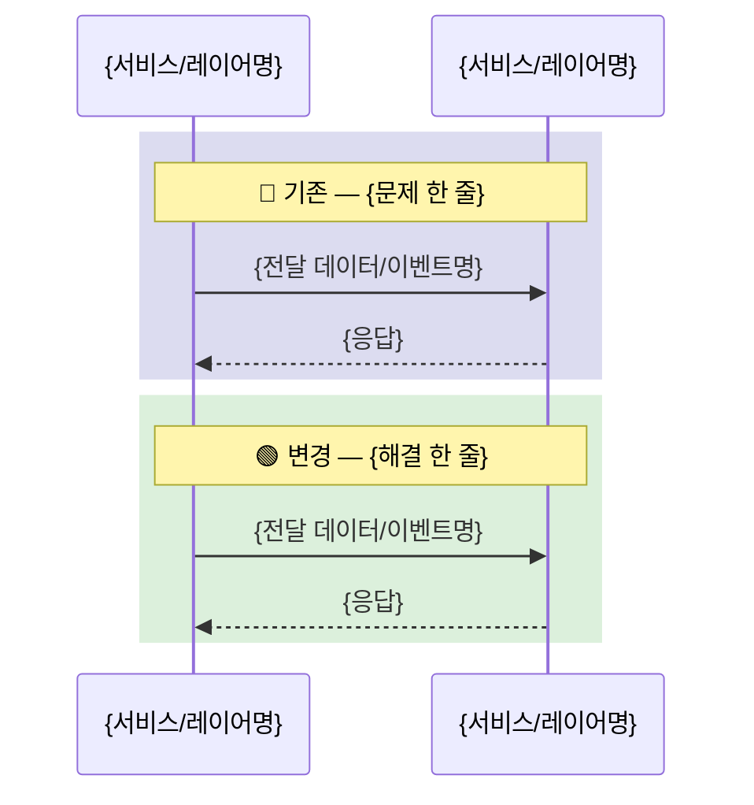
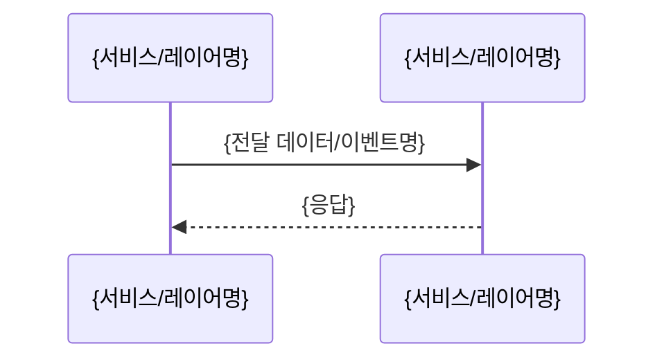

# PR Summary Template — 본문 템플릿 + 작성 지침

> ⚠️ **인라인 통합 안내**: 이 내용은 `commands/summary.md` §4-8에 인라인 통합됨. 수정 시 command 파일을 직접 수정할 것.

> **적용 대상**: §SUMMARY.CREATE Step 6 (compose_body)

---

## 1. PR 제목 형식

```
{ticket prefix}{type}: {간결한 한국어 설명}
```
- type: `feat` / `fix` / `refactor` / `docs` / `test` / `chore`
- **ticket prefix**: 프로젝트에 이슈 트래커 티켓이 존재하면 `[TICKET-ID] ` 형식으로 prefix를 붙인다 (예: `[PROJ-123] feat: ...`). 티켓이 없으면 prefix 없이 type부터 시작한다.

---

## 2. PR 본문 템플릿

```markdown
## 연관된 이슈 (optional — 이슈 트래커 티켓이 있을 때만 포함)

> {TICKET-ID}

## 문제

> {사용자가 할 수 없는 것 또는 시스템의 잘못된 동작 — "~해도 막히지 않는다", "~할 수 없다", "~오류가 난다" 형식으로 1문장}

## 해결 조건

| # | 해결 조건 |
|---|----------|
| S-1 | {해결 후 보장되는 상태를 선언적으로 서술} |
| S-2 | {해결 후 보장되는 상태를 선언적으로 서술} |

## 구현



> flow_change = false (순수 신규 기능)인 경우, rect 블록 없이 단일 흐름:



### 1단계 — {논리 단위 이름}

{인과 서술: 무엇이 문제/한계였는가 → 어떤 변경을 했는가 → 그 결과 무엇이 가능해졌는가. 2-4문장. 파일명 인라인 금지.}

{선택적 Before/After — 핵심 변환을 직관적으로 보여줄 때만 포함:}
```
// Before
{변경 전 상태}

// After
{변경 후 상태}
```

<details>
<summary>변경 파일 ({파일 수}개)</summary>

- {이유/맥락 먼저, 결정을 자연스러운 문장으로}
  - `{모듈 상대경로/파일명}` (신규)
- {이유/맥락 + 결정}
  - `{모듈 상대경로/파일명}` (변경)
    - {파일별 세부 변경사항 — 이유/맥락만으로 충분하지 않을 때만 기재}
  - `{모듈 상대경로/파일명}` (변경)

</details>

### 2단계 — {논리 단위 이름}

{인과 서술: 1단계의 결과를 받아 무엇을 했는가 → 왜 이 단계가 필요했는가 → 결과. 2-4문장.}

<details>
<summary>변경 파일 ({파일 수}개)</summary>

- {이유/맥락 + 결정}
  - `{모듈 상대경로/파일명}` (변경)

</details>

## 의사결정

- **{결정 제목}**
  - {검토한 대안 명시 + 왜 이 방향을 선택했는지 1-2문장}

## 테스트

| 조건 | 내용 | TC | 전제 | 유형 | 시나리오 | 확인 항목 | 결과 |
|------|------|----|------|------|---------|---------|------|
| S-1 | {조건 요약 — 첫 행에만} | TC-1 | {선행 상태, 없으면 비움} | {브라우저/API/단위 테스트/정적 분석} | {무엇을 했는지} | {무엇을 확인했는지} | ✅ |
| | | TC-2 | | {유형} | {시나리오} | {확인 항목} | ✅ |
| S-2 | {조건 요약} | TC-3 | {전제} | {유형} | {시나리오} | {확인 항목} | ✅ |

## 리뷰 요구사항 (optional — 특정 리뷰어에게 요청할 사항이 있을 때만 포함)

> {없으면 섹션 생략}

## 배포할 애플리케이션 (optional — 프로젝트에 다중 배포 단위가 있을 때만 포함)

- [ ] {배포 단위 1}
- [ ] {배포 단위 2}
```

---

## 3. 섹션별 작성 지침

### 문제

- 기술적 원인이 아닌 **관찰 가능한 증상**을 서술한다
- 주어: 사용자 행위 또는 시스템의 잘못된 동작 (시스템 내부 상태 서술 금지)
- 서술 패턴:
  - `~해도 막히지 않아, ~가 공존할 수 있다` — 허용되어선 안 되는 것이 허용되는 경우
  - `~가 안 되어 ~를 할 수 없다` — 기능 부재
  - `~하면 오류가 발생한다` — 잘못된 에러
- 금지: 원인-결과를 기술적으로 추상화한 서술
- 예시:
  - ❌ `동일 회사 내에서 Workflow 이름이 중복될 수 있어, 이름으로 Workflow를 식별하는 시나리오에서 충돌이 발생한다.`
  - ✅ `같은 이름으로 Workflow를 중복 생성해도 막히지 않아, 동일 회사 내에서 같은 이름의 Workflow가 여러 개 공존할 수 있다.`

**프로젝트 플랜 연동**: PROBLEM.md §1(증상) + §3(해결 조건)에서 직접 매핑. 프로젝트 플랜 없으면 diff에서 역추론.

### 해결 조건

- 각 행: "어떤 입력에 어떤 출력/상태가 보장되는가"를 선언적으로 서술
- 구현 방법이 아닌 **관찰 가능한 결과**로 서술
- 2~6개 행이 적절
- **프로젝트 플랜 연동**: 설계 원칙(P-N) → S-N 행으로 변환. Subtask Predicate에서 검증 가능한 조건 추출.

### 구현 논리 단위

diff 파일을 가장 자연스러운 축으로 그룹화한다:

| 분류 기준 | 적합한 경우 |
|-----------|------------|
| **기능/검증 대상별** | 독립적인 제약/기능을 동시에 구현할 때 |
| **코드 흐름/진입점별** | 동일 로직이 여러 API 경로에 적용될 때 |
| **서비스/레이어별** | 멀티 서비스 변경 시 |
| **인과 단계별** | 변경이 순차적 의존관계를 가질 때 (A를 만들어야 B가 가능) |

그룹 수는 2~4개.

#### 논리 단위 서술 규칙

각 논리 단위의 **주 서술**(narrative)은 인과 관계 흐름을 따른다:

1. **문제/한계**: 이 단위가 해결하는 구체적 문제 또는 이전 상태의 한계 (1문장)
2. **변경**: 무엇을 어떻게 바꿨는가 (1-2문장)
3. **결과**: 이 변경으로 무엇이 가능해졌는가 또는 어떤 보장이 생겼는가 (1문장)

서술 금지 사항:
- 파일명을 narrative에 인라인하지 않는다 (파일은 `<details>` 안에서만)
- "~를 추가했다", "~를 변경했다" 나열 금지 — 반드시 "왜"가 선행해야 한다
- 첫 단위의 narrative는 독립적으로 읽히고, 후속 단위는 이전 단위의 결과를 받아서 시작한다

#### Before/After 블록 (선택적)

핵심 변환을 직관적으로 보여줄 때 narrative 직후, `<details>` 직전에 포함한다. 코드 펜스 안에 `// Before` / `// After` 주석으로 구분한다.

포함 기준:
- 반환 타입, 데이터 구조, API 응답 형태가 바뀌는 경우
- 알고리즘/로직 흐름이 본질적으로 달라지는 경우
- 논리 단위당 최대 1개. 여러 변환이 있으면 가장 핵심적인 것 하나만 선택한다

금지:
- 단순 메서드 추가, 필드 추가 등 diff를 보면 바로 알 수 있는 변경

#### 변경 파일 상세 (`<details>` 블록)

파일별 changelog는 `<details>` 태그 안에 보존한다:

```html
<details>
<summary>변경 파일 ({파일 수}개)</summary>

{기존 context-first bullet 규칙(§5-3) 그대로 적용}

</details>
```

- `<summary>`의 파일 수는 해당 논리 단위에 속한 파일 총 수
- `<details>` 내부의 bullet 규칙은 §5-3을 그대로 따른다
- 논리 단위당 파일이 1개뿐이면 `<details>` 없이 narrative 말미에 파일명만 표기 가능: `...변경했다. → \`{파일명}\` (변경)`

### 의사결정

diff/프로젝트 플랜에서 **여러 대안 중 하나를 선택한 흔적**을 찾는다.

식별 신호:
- fallback 핸들러, 이중 방어 구조
- 신규 컴포넌트 생성 (왜 기존에 inline으로 넣지 않았는가?)
- 기존 동작 변경 (왜 하위 호환이 아닌가?)
- 코드 주석에 "~대신 ~로 처리" 등 대안 언급

포함 기준: 두 가지 이상의 구현 방식이 실제로 고려될 수 있고, 선택 이유가 코드를 읽어도 바로 드러나지 않는 경우.

**의사결정이 0건이면 `## 의사결정` 섹션 전체를 생략한다.**

### 해결 조건 구현 여부 확인

각 해결 조건이 diff에서 실제로 구현되었는지 확인:
- ✅ 구현됨
- ❌ 누락 → PR 본문 주의 사항에 명시

---

## 4. Mermaid 다이어그램 규칙

- 항상 `sequenceDiagram` 사용
- 작성 후 반드시 mmdc로 syntax 검증:
  ```bash
  echo "{diagram}" > /tmp/pr-diagram.mmd && mmdc -i /tmp/pr-diagram.mmd -o /tmp/pr-diagram.svg
  ```

### participant 규칙

- max 5개. 클래스명이 아닌 서비스/레이어명 사용
  - ❌ `WorkflowNameValidator`, `WorkRepo`
  - ✅ `app-api`, `DB`, `Frontend`
- `participant A as {이름}` alias 형식 사용
- 멀티레포 피쳐 (FE + BE 동시 변경):
  - max 5개 초과 시 우선순위: 외부 진입점 > 레포 단위 서비스 > 내부 컴포넌트
  - 레포 간 화살표 레이블에 프로토콜 명시
    (예: `HTTP GET /chat/{id}/history`, `Socket.IO work command`)

### rect 블록 규칙

- `flow_change = true`일 때만 사용
- 기존 흐름: `rect rgb(220,220,240)` + `Note over ...: 🔴 기존 — {문제 한 줄}`
- 신규 흐름: `rect rgb(220,240,220)` + `Note over ...: 🟢 변경 — {해결 한 줄}`
- 두 블록 합쳐 10줄 이하 유지 (핵심 흐름만)
- 10줄 초과 시 다음 순서로 축소:
  1. 중간 hop 생략 — A→B→C를 A→C로 묶고 레이블에 "(via B)" 표기
  2. before/after 공통 구간을 Note로 대체 — `Note over A,B: (인증·라우팅 등 공통 흐름 동일)`

### 화살표 규칙

핵심 목록:
- `->>`  : 요청/호출 (응답 대기)
- `-->>`  : 응답/반환
- `-)`   : 비동기 전송 (Socket emit, 이벤트 발행 등, 응답 대기 없음)
- `--)`  : 비동기 응답

레이블 규칙:
- 실제 전달되는 데이터/이벤트명 명시 필수
  - ✅ `Socket.IO work command`, `metadata_json={type, payload}`, `ChatContext(message, metadata)`
  - ❌ 한국어 동사만: `호출`, `저장`
  - ❌ 메서드명: `run_work_agent()`
- 10줄 이하 유지가 우선 — 충돌 시 데이터명은 핵심 1~2개만 남기고 나머지 생략 가능

---

## 5. 구현 서술 원칙

### 5-1. 주 서술 (narrative) 원칙

- 각 논리 단위의 주 서술은 **인과 관계 흐름**을 따른다: 문제/한계 → 변경 → 결과
- 2-4문장으로 작성하며, 파일명을 narrative 안에 인라인하지 않는다
- 주 서술만 읽어도 "이 논리 단위가 왜 존재하고 무엇을 달성하는지"를 이해할 수 있어야 한다
- 후속 단위의 narrative는 이전 단위의 결과를 자연스럽게 이어받는다
- 금지: "~를 추가했다", "~를 수정했다" 나열 (changelog 패턴). 반드시 "왜"가 선행해야 한다

### 5-2. Before/After 블록 원칙

- narrative 직후, `<details>` 직전에 위치한다
- 코드 펜스 안에 `// Before` / `// After` 주석으로 변환 전후를 보여준다
- 코드 스니펫, 데이터 구조, API 응답 형태 등 변환의 양쪽을 보여줄 때만 사용한다
- 논리 단위당 최대 1개. 여러 변환이 있으면 가장 핵심적인 것 하나만 선택한다
- 단순한 필드 추가, 메서드 추가 등 diff를 보면 바로 파악되는 변경에는 사용하지 않는다

### 5-3. 변경 파일 bullet 원칙 (`<details>` 내부)

`<details>` 블록 안의 파일별 상세에는 기존 context-first 규칙을 그대로 적용한다:

- 이유/맥락을 먼저 서술, 파일명은 하위 bullet로 분리
- 파일명에는 **모듈 상대경로**를 포함한다. 레포 루트가 아닌 의미 있는 모듈/패키지 루트 기준으로 경로를 축약하여, 리뷰어가 파일의 위치와 레이어를 즉시 파악할 수 있도록 한다.
  - ✅ 올바른 예: `` `agent/context/socketio_service` ``, `` `chat/service/ChatServiceTest` ``
  - ❌ 잘못된 예 (레포 루트부터 전체 경로): `` `src/main/kotlin/com/viralpick/commerceos/chat/service/ChatServiceTest` ``
  - ❌ 잘못된 예 (파일명만): `` `socketio_service` ``, `` `ChatServiceTest` ``
  - 경로 깊이 기준: 모듈/패키지 최상위부터 2–3 depth가 적절. 프로젝트 구조에 따라 판단하되, **파일이 어느 모듈·레이어에 속하는지** 식별 가능한 최소 경로를 사용한다.
- 파일명이 있는 줄에는 **`` `{모듈 상대경로/파일명}` (신규) `` 또는 `` `{모듈 상대경로/파일명}` (변경) `` 만** 올 수 있다. 그 외 어떤 내용도 같은 줄에 추가하지 않는다. `:`, `—`, `()` 안 메서드 목록 등 모든 인라인 부연 금지.
- 파일별 세부 변경사항(메서드 추가, 필드 변경 등)은 파일명 **다음 줄**에 들여쓰기 하위 bullet로만 표현한다. 상위 이유/맥락만으로 충분히 전달되면 세부 bullet 자체를 생략한다.
  - ✅ 올바른 예: `` - `order/service/OrderService` (변경) `` → 다음 줄 ``    - createOrder, updateOrder에 validateInput 호출 추가 ``
  - ❌ 잘못된 예 (`:` 우회): `` - `order/service/OrderService` (변경): createOrder, updateOrder ``
  - ❌ 잘못된 예 (`—` 우회): `` - `order/service/OrderService` (변경) — createOrder, updateOrder ``
- 소스 파일은 언어 관례에 따라 확장자를 생략하고, 설정/마이그레이션/스크립트 파일은 확장자를 포함한다
- 신규: `(신규)`, 수정: `(변경)`, 한 줄에 파일 하나
- 자연스러운 문장으로 — 기호처럼 느껴지는 단어 나열 금지

---

## 6. 테스트 표 규칙

- `TC` 값은 `TC-1`, `TC-2`, `TC-3`, ... 형식
- `내용` 컬럼은 각 조건 그룹 첫 행에만 기재, 이후 행은 빈 셀
- `전제`: 테스트 시작 전 필요한 상태 한 줄, 없으면 빈 셀
- 유형 4가지 중 택일: `브라우저` / `API` / `단위 테스트` / `정적 분석`

---

## 7. 기타 규칙

- **헤더 이모지** — 섹션 헤더에 이모지 사용 금지. ✅ ❌은 결과 표기 등 인라인에만 사용

- **배포 앱 판정** (프로젝트에 다중 배포 단위가 있을 때만 적용)
  - diff에서 변경된 파일 경로를 프로젝트의 배포 구조와 대조하여 영향받는 배포 단위를 판정한다
  - 공유 모듈(core, shared, common 등)만 변경된 경우 → 해당 모듈을 의존하는 배포 단위를 체크
  - 배포 단위가 하나뿐인 프로젝트는 이 섹션을 생략한다
